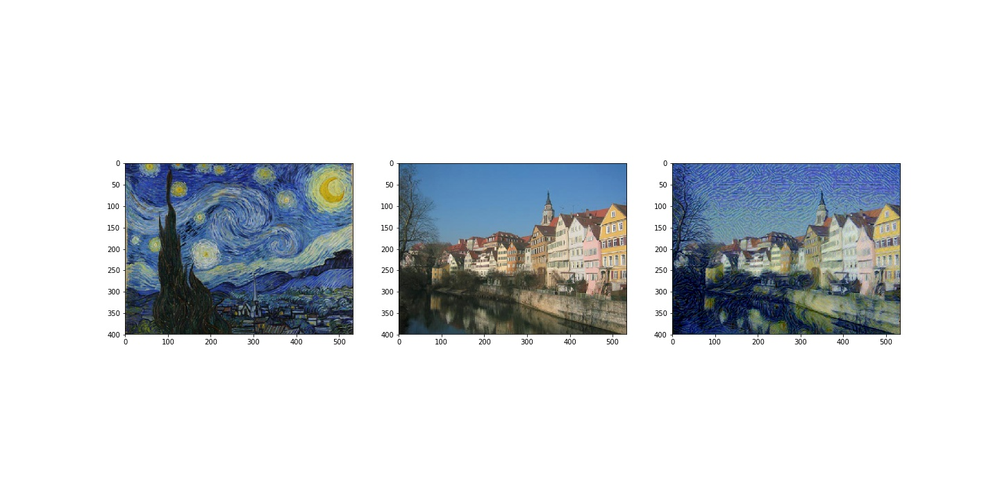
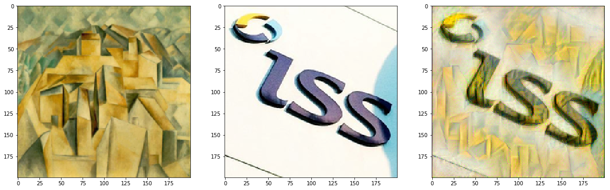
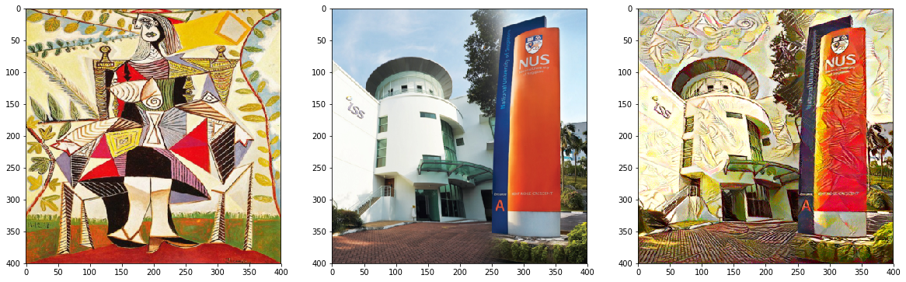
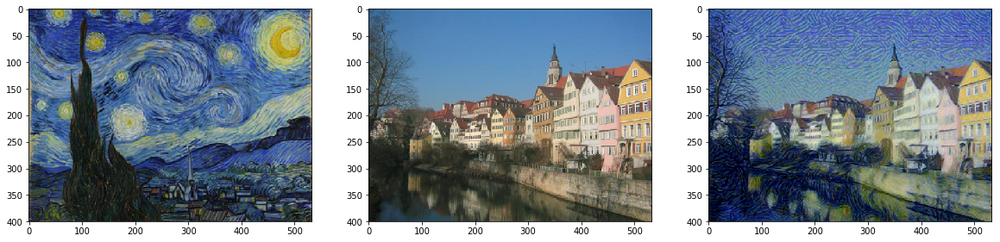

# Style Transfer with Neural Nets
This repository contains a PyTorch implementation of the style transfer method that is outlined in the paper, [Image Style Transfer Using Convolutional Neural Networks](https://www.cv-foundation.org/openaccess/content_cvpr_2016/papers/Gatys_Image_Style_Transfer_CVPR_2016_paper.pdf), by Gatys.

In addition, CloudFormation templates for a produdction-level pipeline are available under the [.aws directory](.aws).

## Results

