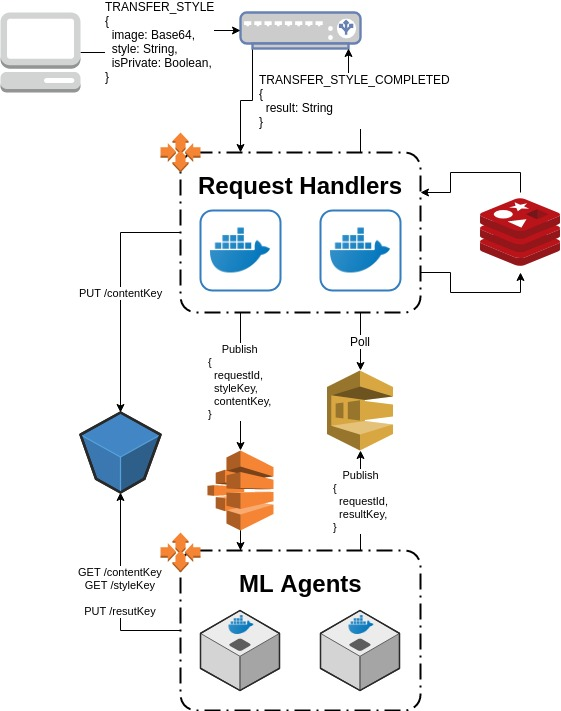
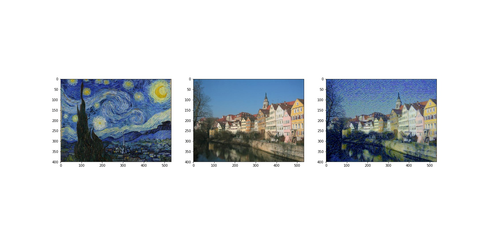
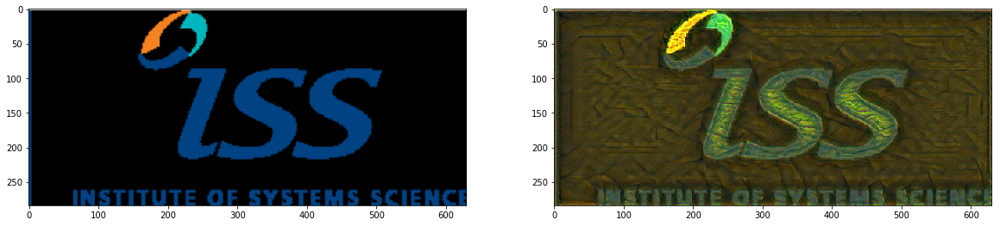
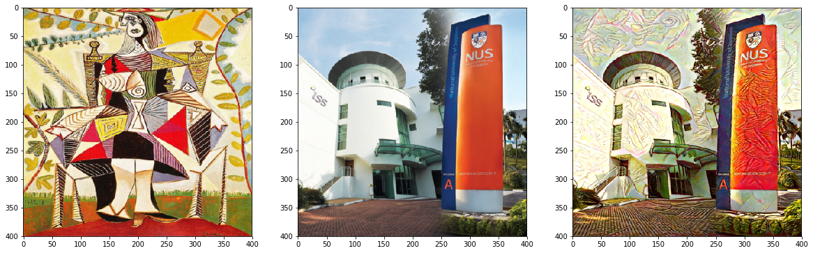
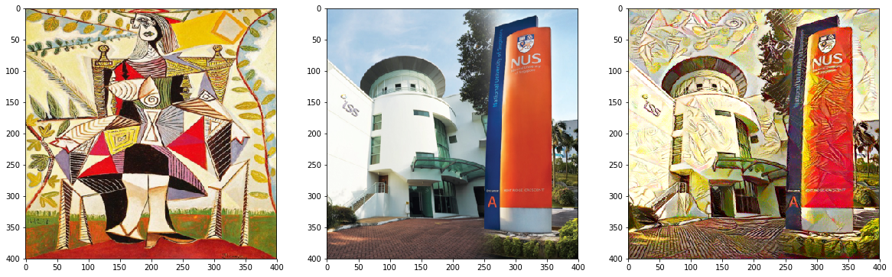
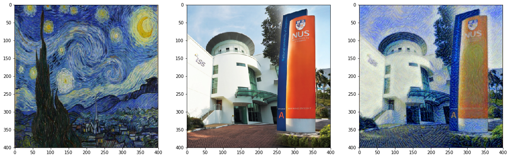

# Style Transfer with Neural Nets
This repository contains a PyTorch implementation of the style transfer method that is outlined in the paper, [Image Style Transfer Using Convolutional Neural Networks](https://www.cv-foundation.org/openaccess/content_cvpr_2016/papers/Gatys_Image_Style_Transfer_CVPR_2016_paper.pdf), by Gatys.

In addition, CloudFormation templates for a produdction-level pipeline are available under the [.aws directory](./.aws).

## Style Transfer Pipeline



Clients make websocket connections to a socket.io server deployed on Fargate. That means no servers to manage and auto-scalability. The client calls the server with the `TRANSFER_STYLE` event and the following body:
```js
{
    image: String, // data URL containing base64-encoded content image data and MIME type
    style: String, // the style image that should be transfered to the content image
    isPrivate: Boolean, // whether or not the content and result images should be publicly accessible
}
```

The server assigns a unique `jobId` to the request, saves the incoming image to `public/input/${jobId}.jpg` in the S3 bucket, or `private` if `isPrivate` is `false`. It also submits a new batch job with the following parameters:
* `contentKey`: the key of the content image in the s3 bucket
* `style`: the style image that should be transferred ot the content image
* `requestId`: a compound identifier made from `${socket.id}::${jobId}`. See below for how this is used.

Finally, the server responds to the client and passes along `requestId`. The client then starts listening for the `TRANSFER_STYLE_COMPLETED::${jobId}` event.

AWS Batch handles spinning up servers and containers to handle incoming batch jobs, so no need to manage servers here either! The style transfer agent reads the content and style images from S3, generates the combined image, saves it to S3, and then publishes the following message to the SQS queue:
```js
{
    resultKey: String, // key in the S3 bucket where the result image was saved
    requestId: String, // the same requestId that was passed to the agent
}
```

The server containers are constantly polling SQS for messages. When the above message is received, `requestId` is parsed back out into `socketId` and `jobId`. However, we can't guarantee that the container which receives the message from SQS is the same one that handled the client request and has the websocket connection to the client. So we set up an Elasticache redis cluster for socket.io to use [as a pub/sub queue](https://github.com/socketio/socket.io-redis), which combined with `socketId` ensures that the response makes its way to the client. This response is the `TRANSFER_STYLE_COMPLETED::${jobId}` event with the following body:
```js
{
    result: String, // the URL where the result image can be accessed
}
```

If `isPrivate` was set to `true` in the request, then the image is stored in a path that is not publicly accessible and the result URL is presigned so that only the requesting client can access it. If `isPrivate` was false, then the image is publicly accessible and `TRANSFER_STYLE_COMPLETED` is broadcast to all connected clients. This event is consumed by the Feed page to add newly processed images to its rotating gallery.

Much thanks to the following sources for assistance and inspiration:
* https://medium.com/containers-on-aws/scaling-a-realtime-chat-app-on-aws-using-socket-io-redis-and-aws-fargate-4ed63fb1b681
* https://github.com/dejonghe/aws-batch-example
* https://github.com/tomas55/aws-gpu-docker-guide


## Results







